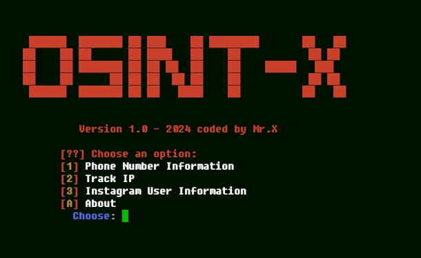

# osint-X

<h2>

 
     
  </h2>
  <hr>

## introduction
<p align="center">
osint-X is a tool for searching phone number information and for tracking phone numbers,perhaps only a few countries whose location can be tracked using this tool. This tool was created by Mr.X to help you get phone number information.
  </details>

## Instalations
```
$ pkg update -y && pkg upgrade -y
$ apt update -y && apt upgrade -y
$ pkg install python -y
$ pkg install git
$ git clone https://github.com/Whomrx666/osint-X.git
$ cd osint-X
$ python osint-X.py
```

## Instructions
- **First**: Install the tools above according to the instructions above
- **Second**: After installing the tools, select one of the options in the tools
- **Third**: Enter the telephone number and others according to the tool's instructions
- **Last**: And the tools will do their job

# All menu
| All Menu | ✔️ |
|--------|--------|
| **Phone Number Information** |✔️ |
| **Track Ip** |✔️ |
| **Instagram User Information** |✔️ |
| **About** |✔️ |
---------

## Observation
This is a tool for education only, I am not responsible for any misuse
### Original Author
<a href="https://github.com/Whomrx666"></a>

### <<< If you copy , Then Give me The Credits >>>

## CONNECT WITH ME :

[](https://whomrxhackers.blogspot.com/)
[](https://twitter.com/whomrx666)
[](https://youtube.com/@whomrx666)
[](https://facebook.com/https://www.facebook.com/whomrx.666)
[](https://t.me/@Whomr_X)
[](https://wa.me/6285933663749)
[](https://www.tiktok.com/@whomr.x)

**If you want to donate, click on the button**
<a href="https://saweria.co/whomrx"></a>

### Visitors :
